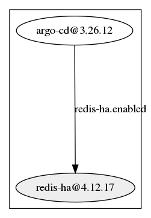
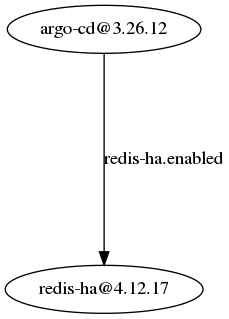

# helm-deps
A tool for identify helm chart dependencies. Can output the information as a dependency graph or a json file. 

To use, pass a path to an existing helm chart folder with a Chart.yaml file. Ensure the latest helm dependencies are fetched using `helm dependency update`. Only works for Helm v3 charts.

```
usage: helmdeps [-h] [--output-dir OUTPUT_DIR]
                     [--output-type {graph,combined-graph,json}] [-v]
                     chart_dir

Build a graph or JSON output of all dependencies for a given Helm chart

positional arguments:
  chart_dir             Location of Chart.yaml file

optional arguments:
  -h, --help            show this help message and exit
  --output-dir OUTPUT_DIR
                        Output location of the file. Defaults to the current
                        directory
  --output-type {graph,combined-graph,json}
                        Type of output
  -v, --verbose         Enable verbose logging
```

## Chart Types
### Dependency Graph
This is the default output that separates each subchart into it's own box. Grey nodes or clusters indicate an conditional dependency, the condition can be seen on the edge label.



### Combined Dependency Graph
This dependency graph does not use unique nodes for each subchart which can be useful to help find common dependencies between charts.



### JSON
Output all dependency information into a JSON file.

[ArgoCD Example:](https://github.com/argoproj/argo-helm/tree/master/charts/argo-cd)

```json
{
    "name": "argo-cd",
    "version": "3.26.12",
    "dependencies": {
        "redis-ha": {
            "name": "redis-ha",
            "version": "4.12.17",
            "repository": "https://dandydeveloper.github.io/charts/",
            "condition": "redis-ha.enabled",
            "dependencies": {}
        }
    }
}
```